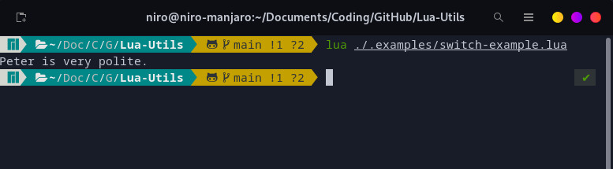

# Lua-Utils

A collection of libraries/modules to ease your coding life with Lua. :)

Feel free to use and or modify the code for your own projects.

## In this collection

### _Switch_

This is an implementation of the Switch/case statement written for Lua, as it
does not have its own switch/case out of the box.

Usage:

```lua
require("Switch")             -- import the module
local switch = Switch.switch  -- optional but recommended for better code readability

local name = "Peter"

switch(name, {
	-- This function will not be run, as name does not equal 'Judy':
	['Judy'] = function()
		print(name .. " is very nice.")
	end,
	
	-- This function will be run, as name matches 'Peter':
	['Peter'] = function()
		print(name .. " is very polite.")
	end,
	
	-- This function will be run if no matches were found:
	['default'] = function()
		print(name .. " wasn't found :(")
	end
})
```

 
